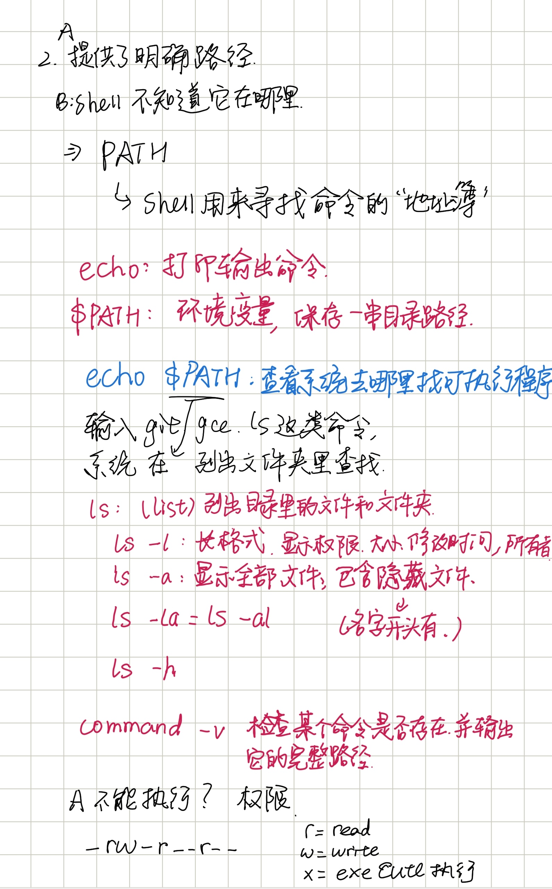
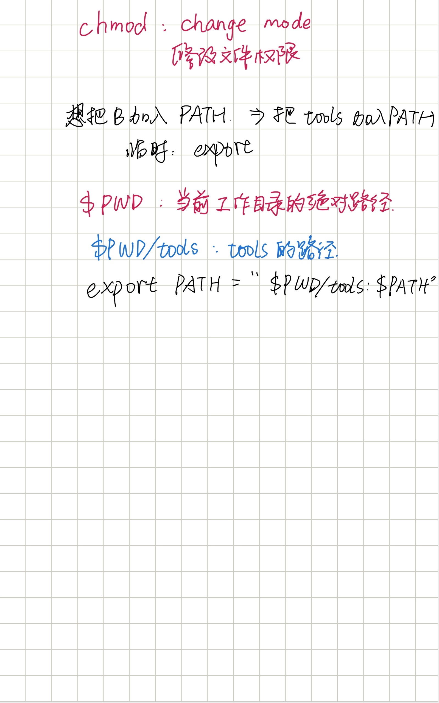
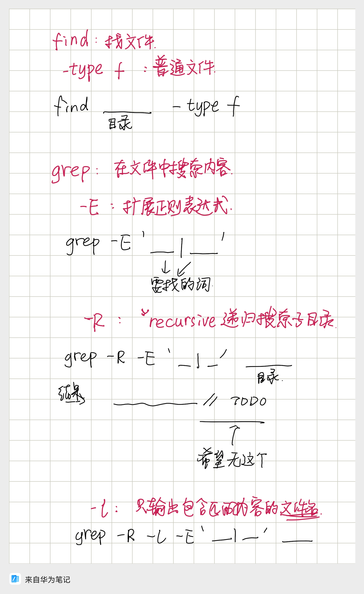
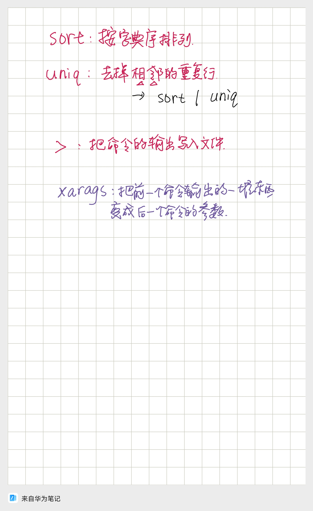
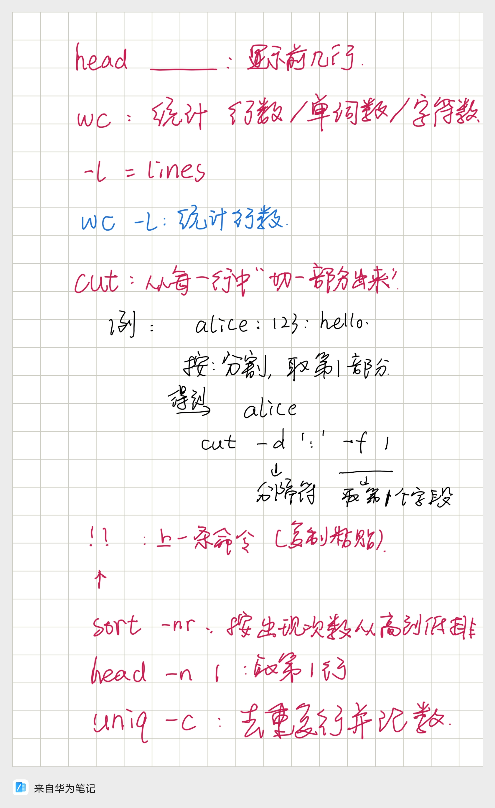
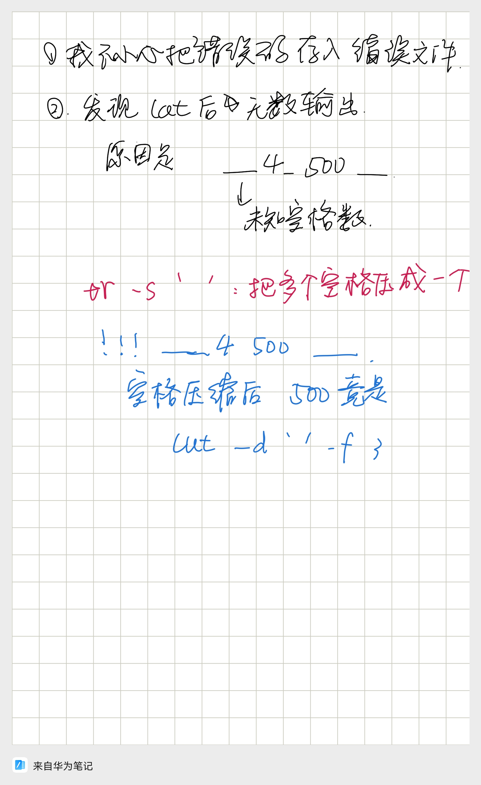
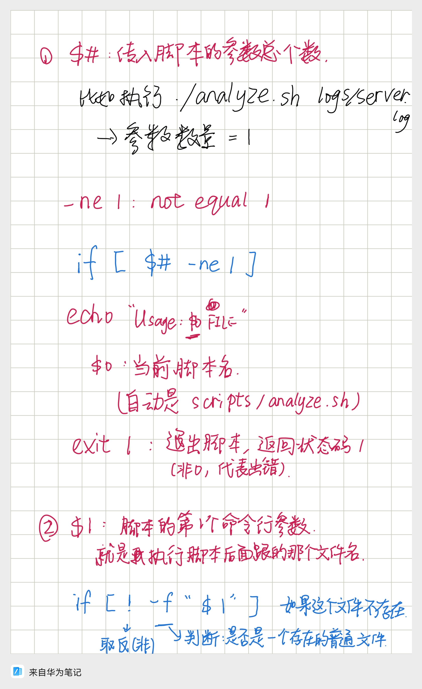
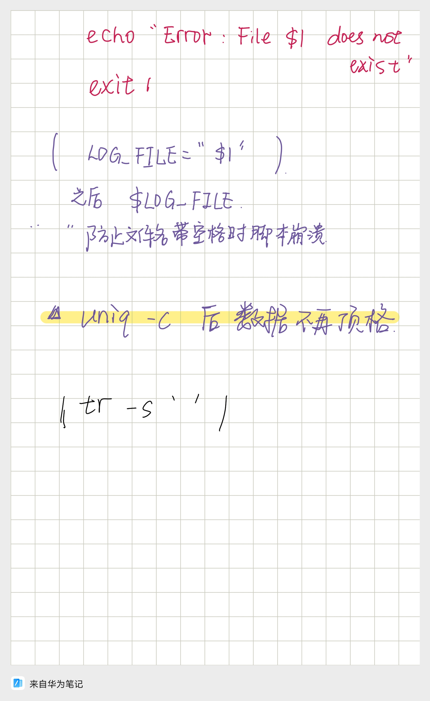
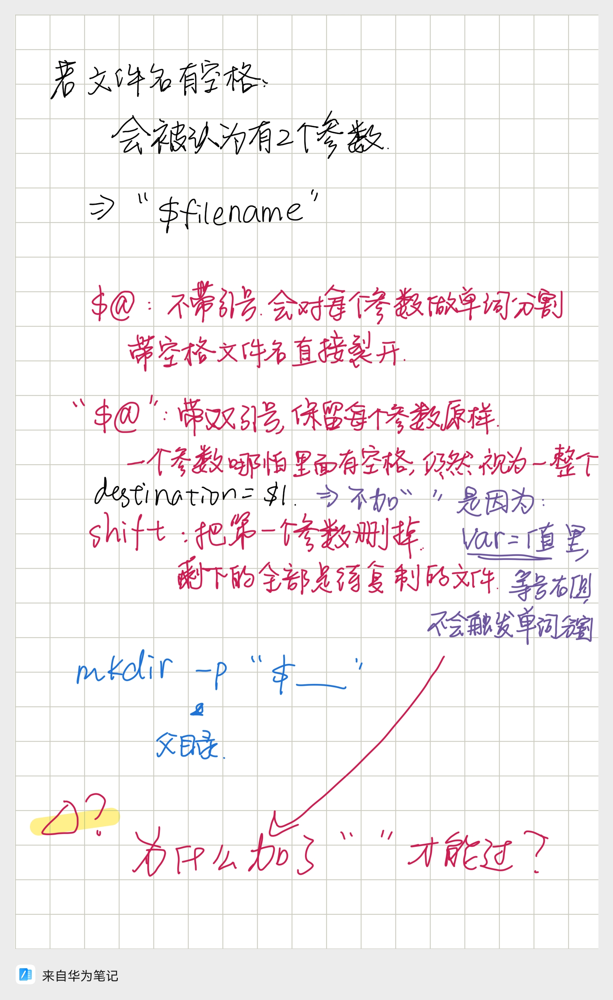

# Task01
## 认识终端与基础命令
### 一、任务目的
* 学会查看当前所在目录、切换目录、列出文件
* 理解绝对路径与相对路径的区别

### 二、核心命令
* `pwd`：打印当前所在目录（print working directory）
* `ls`：列出当前目录下的文件与文件夹
* `cd`：切换目录（change directory）
  * `cd ..`：回到上一级目录
  * `cd 文件夹名`：进入指定文件夹
  * `cd ~`：回到用户家目录
* `cat`: 把文件内容显示到终端
### 三、知识点总结
* 绝对路径：从根目录`/`开始写完整路径，任何位置都可以使用
* 相对路径：以当前目录为起点，不用写`/`开头
* `.`代表当前目录，`..`代表上一级目录

---
# Task02

---
# Task03

---
# Task04

---
# Task05
## 一、任务目的
* 学会使用pipeline

## 二、核心命令
* 全部在Task04都有被运用

## 三、知识点总结
* ` | ` 将左边命令的标准输出交给右边命令作为标准输入，**不产生临时文件，内存直接传递数据**

---
# Task06
## 一、任务目的
* 认识正确输出、错误输出以及保存
* 理解`tee`的应用

## 二、核心命令
* `stdout`:标准输出
* `stderr`:标准错误
* `>`:重定向
* `2>`:把`stderr`存入
* `tee`:一份数据流一边打印屏幕，一边写入文件

## 三、知识点总结
* `tee`只捕获`stdout`，不会对`stderr`进行处理
* 我的错误：终端显示“permission denied”通常对应无权限，需进行`chmod +x`处理

---
# Task07
## 一、任务目的
* 使脚本按要求运行

## 二、核心命令
* `$#`:传入脚本的参数总个数
* `-ne 1`：not equal 1
* `$0`:当前脚本名
* `exit 1`:退出脚本，返回状态码（非0，代表出错）
* `$1`:脚本的第一个命令行参数（就是执行脚本后面跟的那个文件名）
* `!`:取反（非）
* `-f`:判断是否是一个存在的普通文件

## 三、知识点总结
* `uniq -c`使用后数据不再顶格，同时也多了一列个数统计，之后不仅要`cut`，还要记得用`tr -s ' '`

---
# Task08
## 一、任务目的
* 认识到文件名中有空格时需要特殊处理

## 二、核心命令
* `$@`:不带引号，会对每个参数做单词分割，带空格文件名直接裂开
* `"$@"`:带双引号，保留每个参数原样。一个参数哪怕里面有空格，任然视为一个整体
* `shift`:把第一个参数删掉，剩下的全部是待复制的文件

